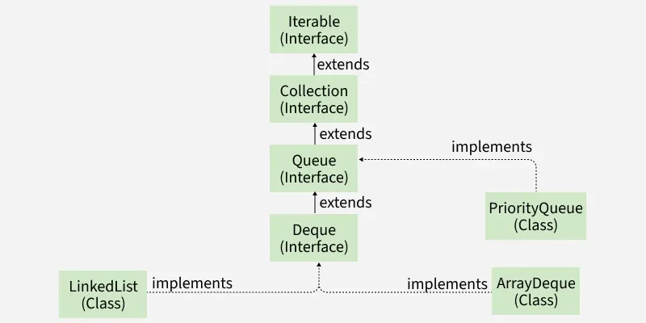

# Priority Queue
- It is a queue in java where elements are ordered based on priority rather than order of insertion
- By default it uses min-heap but custom comparator can be used to define different priorities
-  Support standard queue operation like - add(), poll(), peek()
-  Automatically grows as elements are added
-  Uses heap structure internally, for adding and removing of priority elements
### Hierarchy
- It implements queue interface which implements collection interface
- 
### Operations
```
// Initialization
    PriorityQueue<Integer> pq = new PriorityQueue<>();

// Adding
for(int i=0;i<3;i++){
            pq.add(i);
            pq.add(1);
        }

// Removal
pq.remove("Geeks");

// Accessing
String element = pq.peek();
```
- **Iterating the queue**
- We first convert queue to array and use an iterator
- Iterator doesn't traverse in priority order 
```
 Iterator iterator = pq.iterator();

        while (iterator.hasNext()) {
            System.out.print(iterator.next() + " ");
        }
```
### Applications
- Used in Dijkstra's and Prim's algorithms. 
### References
- [PriorityQueue in Java](https://www.geeksforgeeks.org/java/priority-queue-in-java/)